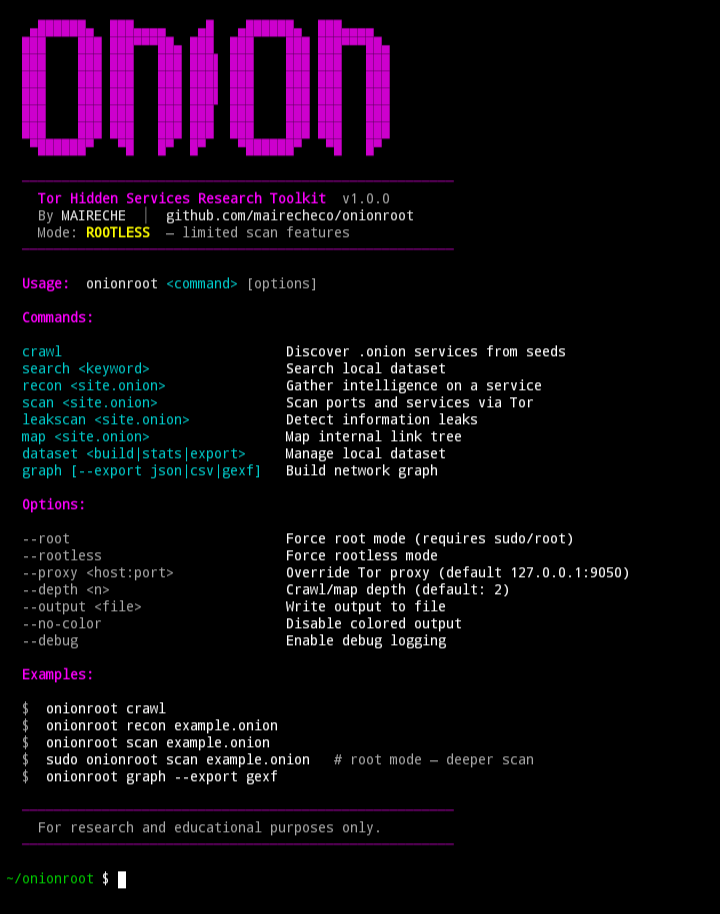

<div align="center">

```
   ▄██████▄  ███▄▄▄▄    ▄█   ▄██████▄  ███▄▄▄▄
  ███    ███ ███▀▀▀██▄ ███  ███    ███ ███▀▀▀██▄
  ███    ███ ███   ███ ███▌ ███    ███ ███   ███
  ███    ███ ███   ███ ███▌ ███    ███ ███   ███
  ███    ███ ███   ███ ███▌ ███    ███ ███   ███
  ███    ███ ███   ███ ███  ███    ███ ███   ███
  ███    ███ ███   ███ ███  ███    ███ ███   ███
   ▀██████▀   ▀█   █▀  █▀    ▀██████▀   ▀█   █▀
```

**Tor Hidden Services Research Toolkit**

[](LICENSE)
[](https://www.gnu.org/software/bash/)
[](https://python.org)
[](https://github.com/mairecheco/onionroot)
[](https://github.com/mairecheco/onionroot/releases)
[](https://github.com/mairecheco/onionroot/stargazers)

</div>

---

## Overview

OnionRoot is a modular, command-line toolkit for **discovering, analyzing, and researching Tor hidden services**. It routes all network activity through the Tor SOCKS5 proxy and provides structured tooling for working with the `.onion` ecosystem.

The tool is designed for:

- Security researchers studying the Tor network
- OSINT analysts conducting dark web investigations
- Privacy engineers auditing onion services for leaks and misconfigurations
- Researchers building datasets of the onion web topology

OnionRoot runs on any Linux distribution and on Termux for Android. It supports two operational modes — **root** and **rootless** — adapting its scan capabilities to the available privilege level automatically.

---

## Preview

<div align="center">

</div>

---

## Features

**Onion Crawler** — Performs BFS discovery of `.onion` services starting from configurable seed URLs. Discovered services are saved to a local JSONL dataset with title, server, links, and discovery metadata.

**Intelligence Gathering** — Fetches and fingerprints an onion service: HTTP headers, server software, technology stack, meta content, embedded `.onion` links, and form detection.

**Port Scanner** — Scans common ports through Tor. In root mode uses torsocks + nmap SYN scan with OS and service detection. In rootless mode uses TCP connect scan or curl SOCKS5 probes as fallback.

**Leak Detection** — Analyzes an onion service for information that could de-anonymize it: clearnet resource references, embedded IP addresses, exposed email addresses, server version disclosure, insecure cookies, sensitive path exposure, and missing security headers.

**Network Mapper** — Recursively follows internal links from an onion service and renders the relationship structure as a depth-indented tree.

**Dataset Management** — Build, query, export, and analyze the local onion services database. Export as JSONL, JSON, or CSV.

**Network Graph** — Parses the dataset and constructs a directed graph of service relationships. Outputs statistics on connectivity, degree distribution, and clustering. Exports to JSON, CSV, or GEXF for visualization in tools like Gephi.

**Local Search** — Full-text search across the local dataset by title, address, or any field.

---

## Installation

**Requirements:** Linux (Debian, Ubuntu, Kali, Arch, Fedora) or Termux · Tor · Python 3.8+ · curl

```bash
git clone https://github.com/mairecheco/onionroot.git
cd onionroot
bash install.sh          # rootless — installs to ~/.local
sudo bash install.sh     # root    — installs to /opt, full scan capabilities
```

The installer detects your distribution and privilege level, installs dependencies (tor, curl, python3, nmap, torsocks), creates the data directory at `~/.onionroot/`, and links the `onionroot` binary.

**Start Tor before use:**

```bash
sudo systemctl start tor          # systemd distros
tor &                              # manual / Termux
```

---

## Usage

```
onionroot <command> [options]
```

| Command | Description |
|---|---|
| `crawl` | Discover new `.onion` services from seed URLs |
| `search <keyword>` | Search the local dataset |
| `recon <site.onion>` | Gather intelligence on an onion service |
| `scan <site.onion>` | Scan ports and services via Tor |
| `leakscan <site.onion>` | Detect information leaks and misconfigurations |
| `map <site.onion>` | Map the internal link tree |
| `dataset <build\|stats\|list\|export\|clear>` | Manage the local dataset |
| `graph [--export json\|csv\|gexf]` | Build and export the network graph |

**Global options:**

```
--root               Force root mode (requires sudo/root)
--rootless           Force rootless mode
--proxy <host:port>  Override Tor SOCKS5 proxy (default: 127.0.0.1:9050)
--depth <n>          Crawl or map recursion depth (default: 2)
--output <file>      Write output to a file
--no-color           Disable ANSI color output
--debug              Enable verbose debug logging
```

**Examples:**

```bash
# Crawl from seed list and build dataset
onionroot crawl

# Recon a specific service
onionroot recon examplexxx.onion

# Scan ports — root mode for SYN scan + OS detection
sudo onionroot scan examplexxx.onion

# Detect leaks and misconfigurations
onionroot leakscan examplexxx.onion

# Map link tree to depth 3
onionroot map examplexxx.onion --depth 3

# Search dataset
onionroot search forum

# Build dataset from seeds
onionroot dataset build

# Export dataset
onionroot dataset export csv

# Graph analysis with Gephi export
onionroot graph --export gexf
```

---

## Root vs Rootless Mode

OnionRoot auto-detects privilege level at launch and adjusts its behavior accordingly.

**Root mode** (`sudo onionroot` or `EUID=0`):
- SYN port scan via `torsocks nmap -sS`
- OS fingerprinting (`nmap -O`)
- Full service version detection (`nmap -sV`) and NSE scripts
- System-wide installation (`/opt/onionroot`, `/usr/local/bin`)
- Automatic dependency installation

**Rootless mode** (default, no sudo):
- TCP connect scan via `torsocks nmap -sT`
- curl SOCKS5 probe fallback when nmap is unavailable
- HTTP banner grabbing for open web ports
- All non-scan modules behave identically to root mode
- Per-user installation (`~/.local/share/onionroot`, `~/.local/bin`)

You can force either mode explicitly:

```bash
onionroot scan target.onion --rootless
sudo onionroot scan target.onion --root
```

---

## Data Storage

All data is stored in `~/.onionroot/`:

```
~/.onionroot/
├── dataset.jsonl      Discovered services in JSONL format
├── visited.txt        Crawler visited-set (deduplication)
├── queue.txt          Crawler work queue
├── onionroot.log      Timestamped activity log
└── cache/             Temporary cache
```

Each dataset entry is a JSON object on a single line:

```json
{
  "onion": "examplexxx.onion",
  "title": "Example Hidden Service",
  "server": "nginx",
  "status": 200,
  "links": ["forum.onion", "mirror.onion"],
  "source": "crawler",
  "discovered": "2026-03-15T12:00:00Z"
}
```

---

## Project Structure

```
onionroot/
├── onionroot              Main CLI entry point
├── install.sh             Installer (Linux + Termux, root + rootless)
├── README.md
├── LICENSE                MIT
├── core/
│   ├── config.sh          Constants, colors, mode detection, output helpers
│   ├── logger.sh          Structured file logging
│   └── utils.sh           tor_curl, dataset I/O, queue management, validation
├── modules/
│   ├── crawler.sh         BFS onion web crawler
│   ├── recon.sh           Intelligence gathering and fingerprinting
│   ├── scanner.sh         Port scanning (root: SYN, rootless: connect)
│   ├── leakscan.sh        Leak and misconfiguration detection
│   ├── search.sh          Local dataset full-text search
│   ├── dataset.sh         Dataset build, stats, list, export, clear
│   ├── map.sh             Recursive link tree mapper
│   └── graph.py           Network graph analysis and export (Python)
├── data/
│   └── seeds.txt          Seed .onion addresses for crawling
└── assets/
    └── preview.png        Terminal screenshot
```

---

## Dependencies

All installed automatically by `install.sh` on supported distributions.

**Required:**

- `tor` — all traffic routes through Tor SOCKS5 (127.0.0.1:9050)
- `curl` — HTTP requests via SOCKS5 proxy
- `python3` — dataset operations and graph analysis (stdlib only, no pip)

**Recommended:**

- `torsocks` — enables nmap to route through Tor
- `nmap` — port scanning (connect scan works without root; SYN scan requires root)

**Optional:**

- `git` — for installation and updates

---

## Contributing

Contributions are welcome. See [CONTRIBUTING.md](.github/CONTRIBUTING.md) for the module architecture, code style guidelines, and pull request process.

- Report a bug → [Issues](https://github.com/mairecheco/onionroot/issues)
- Request a feature → [Feature request](https://github.com/mairecheco/onionroot/issues/new?template=feature_request.md)
- Add seeds → PR to `data/seeds.txt`

---

## Legal

OnionRoot is intended for **security research, privacy auditing, and educational use only**.

Users are responsible for ensuring their use complies with applicable laws. The author accepts no liability for misuse. Only analyze services you have authorization to test. The Tor network should be used responsibly and ethically.

---

## Author

- GitHub — [github.com/mairecheco](https://github.com/mairecheco)
- Instagram — [@maireche.exe](https://instagram.com/maireche.exe)
- TikTok — [@abdou_mhf7](https://tiktok.com/@abdou_mhf7)

---

## License

MIT License — Copyright (c) 2026 MAIRECHE

---

<div align="center">
<sub>If OnionRoot is useful to your research, a ⭐ is appreciated.</sub>
</div>
